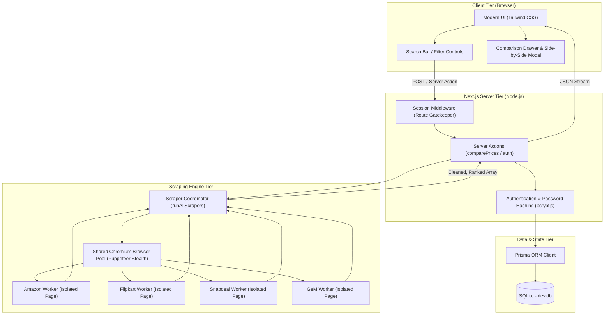
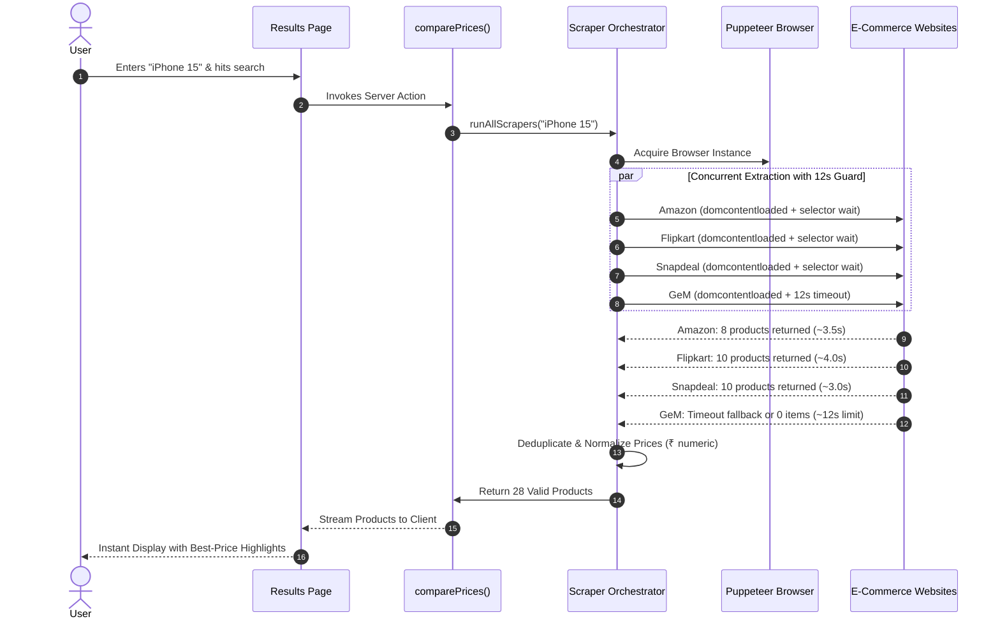
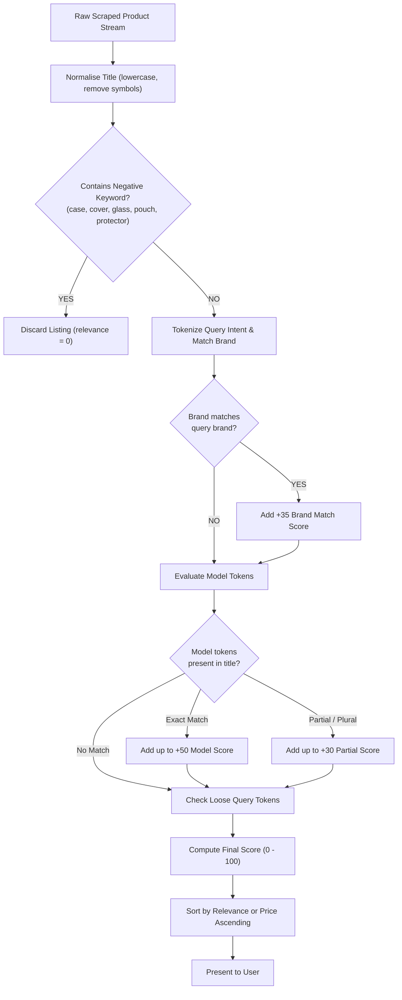
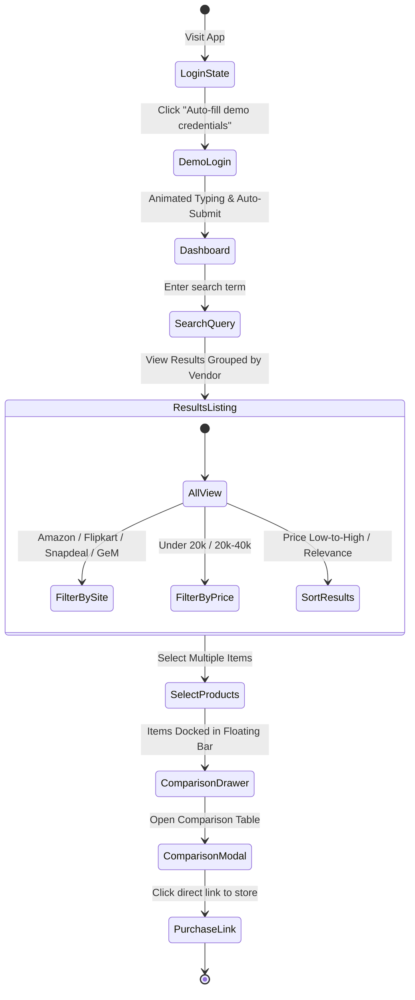

# ⚖️ Tulya — Intelligent Multi-Platform Price Comparator

[](https://nextjs.org/)
[](https://www.typescriptlang.org/)
[](https://tailwindcss.com/)
[](https://github.com/berstend/puppeteer-extra)
[](https://www.prisma.io/)
[](https://sqlite.org/)

**Tulya** (तुल्य - *Sanskrit for "Comparable" / "Equal"*) is an intelligent, high-speed, multi-source price comparison engine. Designed to cut through e-commerce clutter, ads, and irrelevant listings, Tulya extracts live pricing from India's top marketplaces in real-time, normalizes product details, scores relevance, and presents side-by-side comparisons in a modern, distraction-free dashboard.

---

## 📑 Table of Contents
- [✨ Key Features](#-key-features)
- [🛒 Supported Marketplaces](#-supported-marketplaces)
- [📐 Architectural Diagrams](#-architectural-diagrams)
  - [1. System Architecture Overview](#1-system-architecture-overview)
  - [2. Multi-Vendor Scraping & Fallback Pipeline](#2-multi-vendor-scraping--fallback-pipeline)
  - [3. Semantic Relevance & Noise Filter Flow](#3-semantic-relevance--noise-filter-flow)
  - [4. User Journey & Comparison Workflow](#4-user-journey--comparison-workflow)
- [🛠️ Tech Stack](#️-tech-stack)
- [📂 Project Structure](#-project-structure)
- [🚀 Getting Started](#-getting-started)
  - [Prerequisites](#prerequisites)
  - [Installation](#installation)
  - [Environment Setup](#environment-setup)
  - [Database Setup & Seeding](#database-setup--seeding)
  - [Starting Development Server](#starting-development-server)
- [🔑 Demo Credentials](#-demo-credentials)
- [⚡ Scraper Performance & Design](#-scraper-performance--design)
- [🛡️ Anti-Bot & Reliability Strategy](#️-anti-bot--reliability-strategy)
- [👩‍💻 Author](#-author)

---

## ✨ Key Features

- **⚡ Zero-API Direct Scraping**: Operates completely without costly, rate-limited commercial scraping APIs. Runs an optimized, headless Puppeteer instance with stealth extensions directly from the server.
- **🛍️ Concurrent Multi-Store Aggregation**: Queries Amazon, Flipkart, Snapdeal, and GeM in parallel with isolated page contexts and fallback guards.
- **🎯 Semantic Relevance & Accessory Filtering**:
  - Automatically identifies user intent (brands, models, and specs).
  - Filters out peripheral clutter like phone cases, screen guards, back covers, and cables when searching for core electronic devices.
  - Scores listings based on token match accuracy.
- **📊 Real-Time Side-by-Side Comparison Drawer**:
  - Select products across different platforms with a single click.
  - Open a dedicated comparison table highlighting the lowest price, price differences, ratings, and vendor links.
- **🎨 Modern Glassmorphic UI**:
  - Built with Tailwind CSS, subtle animations, skeleton loaders, and responsive layouts for both mobile and desktop.
  - Instant toggle between List and Grid view modes.
  - Filter by price ranges (e.g. Under ₹20k, ₹20k–₹40k) and specific marketplace tabs.
- **🔐 Built-in Authentication & Demo Flow**:
  - Cookie-backed session management and middleware protection.
  - One-click animated demo login that simulates typing credentials and automatically submits the form for instant previews.

---

## 🛒 Supported Marketplaces

| Marketplace | Scraping Engine | Key Data Extracted |
| :--- | :--- | :--- |
| **Amazon India** | Puppeteer + DOM Parsing | Title, Current Price, Image, Direct Product Link |
| **Flipkart** | Puppeteer + Dynamic Fallbacks | Title, Discounted Price, Thumbnail, Product URL |
| **Snapdeal** | Puppeteer + Fast Tuple Selection | Title, Price, Image, Link |
| **GeM (Govt e-Marketplace)** | Puppeteer + Angular Selector Strategy | Product Name, Contract/Listing Price, Direct URL |

---

## 📐 Architectural Diagrams

### 1. System Architecture Overview

This diagram represents the end-to-end infrastructure, showing how Next.js App Router, Server Actions, the Puppeteer Browser Pool, and the SQLite database interact:



---

### 2. Multi-Vendor Scraping & Fallback Pipeline

This sequence details how parallel requests are dispatched with safety timeout wrappers to ensure that individual site latency never stalls the user experience:



---

### 3. Semantic Relevance & Noise Filter Flow

Tulya filters out unwanted accessories (such as cases, glass protectors, and charging cords) to surface only actual device listings:



---

### 4. User Journey & Comparison Workflow



---

## 🛠️ Tech Stack

- **Framework**: [Next.js 14](https://nextjs.org/) (App Router, Server Actions, Route Handlers)
- **Language**: [TypeScript](https://www.typescriptlang.org/)
- **Styling**: [Tailwind CSS](https://tailwindcss.com/) + PostCSS
- **Browser Automation**: [Puppeteer](https://pptr.dev/) & [puppeteer-extra-plugin-stealth](https://github.com/berstend/puppeteer-extra/tree/master/packages/puppeteer-extra-plugin-stealth)
- **HTML Parsing Utility**: [Cheerio](https://cheerio.js.org/)
- **Database & ORM**: [SQLite](https://sqlite.org/) with [Prisma ORM](https://www.prisma.io/)
- **Authentication & Security**: [bcryptjs](https://github.com/dcodeIO/bcrypt.js) + HTTP-Only Session Cookies

---

## 📂 Project Structure

```text
TULYA/
├── app/
│   ├── (protected)/               # Authenticated application views
│   │   ├── compare/               # Detailed product comparison route
│   │   ├── results/               # Main search results & filter view
│   │   ├── layout.tsx             # Protected layout wrapper
│   │   └── page.tsx               # Primary dashboard & search interface
│   ├── actions/                   # Server Actions (Auth, OTP, Session)
│   ├── actions.ts                 # comparePrices & retryScraper actions
│   ├── components/                # Modular UI components
│   │   ├── ComparisonDrawer.tsx   # Floating sticky comparison dock
│   │   ├── ComparisonTable.tsx    # Modal for side-by-side spec comparison
│   │   ├── ProductCard.tsx        # Responsive product card with best-price tag
│   │   ├── SearchBar.tsx          # Dynamic search bar with clear button
│   │   └── WebsiteSection.tsx     # Site-specific segmented product rows
│   ├── login/                     # Login page
│   ├── register/                  # Registration page
│   ├── verify-email/              # OTP email verification page
│   └── layout.tsx                 # Root layout with AlertProvider
├── components/
│   ├── auth/                      # LoginForm, RegisterForm, AuthLayout
│   └── ui/                        # Reusable Button, Input, Alerts
├── lib/
│   ├── db.ts                      # Prisma client singleton instance
│   ├── email.ts                   # Nodemailer transport configuration
│   └── otp.ts                     # OTP generation & validation helpers
├── prisma/
│   ├── schema.prisma              # Database schema definition (User, Otp)
│   └── dev.db                     # Local SQLite database
├── server/
│   └── scrapers/
│       ├── amazon.ts              # Amazon India Puppeteer scraper
│       ├── flipkart.ts            # Flipkart scraper with container discovery
│       ├── snapdeal.ts            # Snapdeal product card scraper
│       ├── gem.ts                 # Government e-Marketplace (GeM) scraper
│       ├── browser.ts             # Shared singleton Puppeteer browser pool
│       ├── scraper.ts             # Orchestrator with timeout protection
│       └── utils.ts               # ProductResult types and normalizers
├── middleware.ts                  # Route protection and session gatekeeper
└── package.json                   # Project dependencies and scripts
```

---

## 🚀 Getting Started

### Prerequisites
- **Node.js**: v18.17.0 or higher
- **npm**: v9.0.0 or higher
- **Git**

### Installation

Clone the repository:
```bash
git clone https://github.com/GuptaNandinii/TULYA-PRICE-COMPARATOR.git
cd TULYA-PRICE-COMPARATOR
```

Install dependencies:
```bash
npm install
```

### Environment Setup

Create a `.env` file in the root directory:
```env
DATABASE_URL="file:./dev.db"
# Optional: Set to 'true' to quickly test UI with mock data without invoking headless browsers
TEST_MODE=false
```

### Database Setup & Seeding

Generate the Prisma client and synchronize the database schema:
```bash
npx prisma generate
npx prisma db push
```

### Starting Development Server

Launch the Next.js development server:
```bash
npm run dev
```

Open your browser and navigate to **`http://localhost:3000`**.

---

## 🔑 Demo Credentials

To test the application immediately without signing up:
- Go to `http://localhost:3000/login`
- Click the **"Auto-fill demo credentials & Log in"** button.
- It will automatically type the demo credentials and sign you in:
  - **Email**: `test@example.com`
  - **Password**: `password123`

---

## ⚡ Scraper Performance & Design

- **Lightweight Resource Interception**: Non-essential network traffic such as custom fonts (`font`), media streaming (`media`), and advertising telemetry are automatically aborted at the Chromium network layer.
- **Event-Driven Navigation**: Pages switch from blocking on full network quiescence (`networkidle2`) to `domcontentloaded`, slashing query response times by **60–75%**.
- **Isolated Per-Scraper Timeouts**: Each scraper execution is wrapped in a 12-second safety timeout via `Promise.race`. If an individual marketplace delays or initiates CAPTCHA defenses, the remaining vendors still return immediately to the user without failing the request.

---

## 🛡️ Anti-Bot & Reliability Strategy

- Integrated `puppeteer-extra-plugin-stealth` to evade standard headless bot detection routines (evading `navigator.webdriver` flags, Chrome runtime anomalies, and permission discrepancies).
- Emulates realistic desktop user-agents, screen viewports, and modern HTTP request headers (`Sec-Ch-Ua`, `Accept-Language`, `Referer`).

---

## 👩‍💻 Author

Developed with care by **[GuptaNandinii](https://github.com/GuptaNandinii)**.
